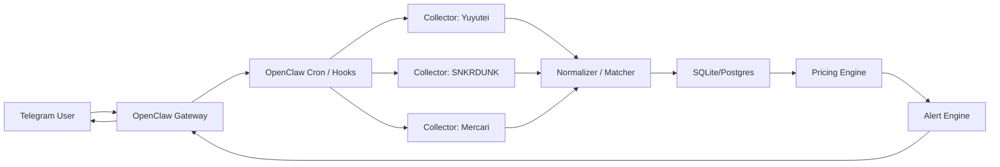

# OpenClaw + Telegram TCG 監控系統規劃

最後更新：2026-04-14

## 1. 文件目的

這份文件是第一版專案藍圖，目標是建立一套可以：

- 用 OpenClaw 與 Telegram 互動。
- 定期監控寶可夢卡牌與 Weiss Schwarz（WS）卡牌的熱門卡與目標卡。
- 從遊々亭、SNKRDUNK、Mercari 與其他可靠來源蒐集價格與行情訊號。
- 在 Mercari 出現明顯低於行情價的物件時，主動通知你。

這份規劃先以「可穩定落地」為優先，而不是一開始就做成全自動交易機器。第一階段只做監控、比價、判定與通知，不做自動下單。

## 2. 核心結論

這個系統建議拆成兩層：

- OpenClaw 負責人機互動、Telegram 對話、排程觸發、任務編排。
- 一組穩定的 Python 資料採集與定價服務負責抓站、正規化、行情計算、低價判斷。

不要把「價格監控、清洗、去重、行情計算」完全交給 agent prompt。這些部分應該是可測試、可重跑、可回溯的程式邏輯；OpenClaw 比較適合做控制面與通知面。

## 3. 先做什麼、不先做什麼

### 第一階段一定要做

- 單人使用的 Telegram bot。
- 目標卡 watchlist 管理。
- 遊々亭價格抓取。
- SNKRDUNK 行情頁或文章頁抓取。
- Mercari 搜尋結果巡檢。
- 低於行情價通知。
- 每日摘要與手動查價。

### 第二階段再做

- 熱門卡自動發現。
- 條件分級（裸卡、PSA、傷卡、未鑑定）。
- 圖片 OCR / 圖像比對，降低錯抓。
- Web dashboard。
- 回測與命中率分析。

### 第一階段先不要做

- 自動購買。
- 高頻、接近即時的秒級輪詢。
- 依賴未公開 API 或繞過站方保護。
- 太複雜的多人權限系統。

## 4. 預設假設

- 使用者是你本人，bot 先走 Telegram 私訊，不先做群組版。
- 時區以 `Asia/Taipei` 為主。
- 市場價格以日圓 `JPY` 為基準。
- 第一版先監控「單卡」，不做 sealed product。
- 第一版先排除 PSA / BGS / CGC 等鑑定卡，避免行情模型過早變複雜。
- 第一版先排除明顯傷卡、套卡、空盒、代抽、代售、卡磚等雜訊。
- 熱門卡先採「人工 watchlist + 半自動熱門候選」混合策略，不直接完全自動發掘。

## 5. 來源分析與資料角色

| 來源 | 主要角色 | 可用資料 | 建議取得方式 | 備註 |
| --- | --- | --- | --- | --- |
| [Pokemon 官方卡牌搜尋](https://www.pokemon-card.com/card-search/) | 官方主資料 | 正式卡名、卡號、彈別、regulation | 站內搜尋 / HTML 擷取 | 用於正規化，不直接當價格來源 |
| [WS 官方卡表](https://ws-tcg.com/cardlist/search) | 官方主資料 | 正式卡名、卡號、作品名、商品線 | 站內搜尋 / HTML 擷取 | 用於正規化，不直接當價格來源 |
| [遊々亭](https://yuyu-tei.jp/) | 基準報價 | 單卡販售價、買取價、卡名、稀有度、系列 | HTML 擷取，必要時用 headless browser | 遊々亭官方 FAQ 明確表示買取價格會持續變動 |
| [Card Rush Pokemon](https://www.cardrush-pokemon.jp/) | 次級店鋪報價 | 單卡販售價、庫存訊號 | HTML 擷取 | 適合補強 Pokemon 賣價參考 |
| [Card Rush 買取頁](https://www.cardrush-pokemon.jp/page/41) | 次級 buylist | 買取價 | HTML 擷取 | 頁面有快取提醒，需保守看待新鮮度 |
| [Hareruya 2 buylist](https://www.hareruya2.com/pages/buying) | 次級 buylist | 買取價、卡目錄訊號 | HTML 擷取 | 可補強 Pokemon 買方價格下界 |
| [SNKRDUNK 指南站](https://help.snkrdunk-guide.com/ja) | 規則與品相語意 | 品相規範、上架規則、名詞語意 | 只做輔助參考 | 這個 help 網域本身不是行情主資料源 |
| [SNKRDUNK 主站](https://snkrdunk.com/) | 行情參考 | 一般相場、買取價格、價格推移、熱門文章 | 針對商品頁 / 文章頁擷取 | 真正價格資料應以主站頁面為主 |
| [magi](https://magi.camp/) | 次級市場深度 | 刊登價、供給深度、流動性 | 搜尋頁巡檢 | Pokemon 與 WS 都可作為 C2C 補充來源 |
| [Mercari](https://jp.mercari.com/) | 機會來源 | 新上架商品、賣價、標題、圖片、賣家資訊 | 搜尋頁巡檢，低頻輪詢 | 不建議碰內部 API，優先公開頁面與合規低頻方式 |
| [Yahoo Flea Market](https://paypayfleamarket.yahoo.co.jp/) | 次級市場深度 | 刊登價、商品深度 | 搜尋頁巡檢 | 可補 C2C 深度，但不一定適合高頻掃描 |
| [Rakuma](https://fril.jp/) | 次級市場深度 | 刊登價、商品深度 | 搜尋頁巡檢 | 對舊卡、套卡、周邊物件特別有參考價值 |

### 關鍵觀察

- OpenClaw 官方文件顯示 Telegram channel 已可正式使用，支援 pairing、allowlist、群組政策、長輪詢與 webhook。
- OpenClaw 內建 cron/scheduler，可將結果直接 announce 到 Telegram 指定 chat。
- 遊々亭 FAQ 明確寫到買取價格在各遊戲的單卡買取頁可查，且「買取價格は常に変動致します」。
- 你提供的 SNKRDUNK help 網域主要是規則與品相說明，不是行情資料主頁；行情要改抓 `snkrdunk.com` 的商品 / 文章 / 相場頁。
- Mercari 官方本身有「保存した検索条件の新着通知」，最多可保存 100 個條件，且新着通知只會推送新上架商品，不會推送既有商品價格變動。這代表 Mercari 原生功能可以當備援，但無法取代跨站比價引擎。
- 官方卡表類來源應先當作「正規化與主資料來源」，避免把錯卡名或錯卡號直接帶進價格模型。
- 店鋪來源與 C2C 來源應分開加權。店鋪價較穩，C2C 價更接近撿漏現場，但雜訊也更高。

## 6. 產品目標

### 主要目標

- 讓你透過 Telegram 直接查卡價、看熱門卡、管理監控名單。
- 自動比較多個來源，建立每張卡的參考行情。
- 當 Mercari 有低於行情的上架物時，在短時間內通知你。

### 成功標準

- 你可以用一句 Telegram 指令或自然語句查指定卡最近行情。
- 每天收到一則寶可夢 / WS 監控摘要。
- 低於行情價的 Mercari 物件在 5 到 15 分鐘內被偵測到。
- 警報誤報率在可接受範圍內，至少能排除大部分傷卡 / 套組 / 非目標品。

## 7. 系統邊界

本系統只處理這幾類事情：

- 卡片資料定義與別名管理。
- 多來源價格蒐集。
- 行情估值。
- 低價新物件偵測。
- Telegram 互動與通知。
- 任務排程、日誌、回溯。

本系統不處理：

- 自動下單。
- 自動議價。
- 倉儲、付款、物流。
- 高頻交易級別的撮合。

## 8. 建議架構



### 角色分工

- OpenClaw Gateway
  - 接 Telegram 訊息。
  - 接收 cron 任務。
  - 觸發報表、查詢、通知。
- Collectors
  - 分站點抓資料。
  - 輸出標準化資料。
- Normalizer / Matcher
  - 把不同來源的卡名、系列名、稀有度、卡號對齊。
- Pricing Engine
  - 生成每張卡的參考行情與置信度。
- Alert Engine
  - 判斷某個 Mercari listing 是否低於行情且值得通知。
- Database
  - 保存卡片主檔、價格快照、listing、警報、任務紀錄。

## 9. 建議技術棧

### 第一版最務實的組合

- 語言：Python 3.12
- 採集：Playwright + httpx + BeautifulSoup / selectolax
- 服務：CLI jobs 為主，必要時補 FastAPI
- 資料庫：SQLite 起步，穩定後升 PostgreSQL
- 排程：OpenClaw cron
- 通知：OpenClaw Telegram channel
- 觀測：structured logs + scan run table

### 為什麼第一版先用 SQLite

- 你現在是單人使用場景。
- 先把資料結構、正規化、偵測邏輯跑穩，比一開始上重型 infra 更重要。
- 真正需要升 PostgreSQL 的訊號，是你開始做歷史回測、多人使用、長期大量 listing 儲存。

## 10. 資料模型

### 10.1 cards

每張標準化卡片一筆：

- `id`
- `game`：`pokemon` / `ws`
- `series_name`
- `set_name`
- `card_name_jp`
- `card_no`
- `rarity`
- `language`
- `variant`
- `active`

### 10.2 card_aliases

處理不同來源名稱寫法差異：

- `card_id`
- `source`
- `alias_text`
- `alias_type`：`exact` / `normalized` / `search_keyword`

### 10.3 market_snapshots

保存各來源每次看到的價格：

- `card_id`
- `source`
- `captured_at`
- `price_jpy`
- `price_type`：`sell` / `buy` / `market` / `listing`
- `condition_bucket`
- `url`
- `raw_payload_json`

### 10.4 mercari_listings

- `listing_id`
- `card_id`
- `title`
- `listed_price_jpy`
- `shipping_cost_jpy`
- `seller_name`
- `seller_score`
- `seller_sales_count`
- `condition_text`
- `listing_url`
- `image_urls`
- `is_sold`
- `first_seen_at`
- `last_seen_at`
- `match_confidence`
- `risk_flags`

### 10.5 fair_values

每張卡在每個時間點的參考行情：

- `card_id`
- `computed_at`
- `reference_price_jpy`
- `confidence_score`
- `inputs_json`

### 10.6 alerts

- `card_id`
- `source_listing_id`
- `triggered_at`
- `reference_price_jpy`
- `listing_price_jpy`
- `discount_ratio`
- `status`：`new` / `sent` / `acknowledged` / `dismissed`

### 10.7 watchlists

- `user_id`
- `card_id`
- `priority`
- `discount_threshold_pct`
- `enabled`

## 11. 卡片正規化策略

這一步是整個系統最重要的基礎，不然低價警報很容易失真。

### 需要對齊的欄位

- 遊戲別：Pokemon / WS
- 卡名
- 系列名 / 彈別
- 卡號
- 稀有度
- 是否同名異圖
- 是否鑑定卡
- 品相級別

### 第一版做法

- 先建立手工 watchlist 主檔。
- 每張卡至少要有：
  - 日文正式卡名
  - 常見簡寫
  - 卡號
  - 稀有度
  - 搜尋關鍵字
- 由 watchlist 驅動 collector，而不是先想做全站全量抓取。

### 為什麼先 watchlist 驅動

- 能大幅降低站點壓力與抓取成本。
- 可先把命中率做準。
- 對寶可夢與 WS 這類大量版本、同名異圖商品特別重要。

## 12. 行情模型設計

### 12.1 第一版參考行情來源

同一張卡的參考價格，優先使用：

1. 遊々亭販售價
2. Card Rush / Hareruya 2 等次級店鋪價或 buylist
3. SNKRDUNK 一般相場
4. Mercari / magi / Yahoo Flea Market / Rakuma 的高可信樣本
5. 遊々亭買取價作為保守下界

### 12.2 不建議直接用平均值

平均值很容易被極端值帶壞。第一版建議使用：

- 加權中位數 `weighted median`
- 或裁尾平均 `trimmed mean`

### 12.3 第一版建議公式

若樣本足夠，優先使用加權中位數：

`reference_price = weighted_median([yuyutei_sell, snkrdunk_market, mercari_recent_valid])`

若 Mercari 成交樣本不足，則退化成：

`reference_price = weighted_median([yuyutei_sell, snkrdunk_market, adjusted_yuyutei_buy])`

其中：

- `adjusted_yuyutei_buy = yuyutei_buy * 1.20 ~ 1.35`
- 實際倍率依卡種與流動性微調。

### 12.4 新鮮度權重

- 24 小時內資料：權重最高
- 2 到 7 天：中等權重
- 超過 14 天：只保留做回溯，不進主參考價

### 12.5 品相處理

第一版只做兩層：

- `normal`
- `damaged_or_risky`

凡是標題或描述出現下列關鍵字，先降權或排除：

- `傷あり`
- `白欠け`
- `折れ`
- `反り`
- `凹み`
- `ジャンク`
- `プレイ用`
- `まとめ売り`
- `空箱`
- `プロキシ`
- `サーチ済`

## 13. 低於行情價判定

### 13.1 必須先過的條件

- 與目標卡匹配信心夠高。
- 不是 bundle / 空盒 / 傷卡 / 明顯假貨風險。
- 不是 PSA / graded listing。
- 不是已經通知過的重複 listing。

### 13.2 建議分級

- `Strong Buy`：`listing_price <= reference_price * 0.78`
- `Watch`：`listing_price <= reference_price * 0.87`
- `Ignore`：高於上述門檻

### 13.3 進一步過濾

以下情況即使便宜，也先不通知或降級：

- 賣家評價過低。
- 圖片數過少。
- 標題太模糊。
- 出現大量非卡片關鍵字。
- 交易條件怪異。

### 13.4 通知內容應包含

- 卡名
- 來源
- listing 價格
- 參考行情
- 折價百分比
- 命中理由
- 風險標記
- 來源連結

### 13.5 範例通知

```text
[低於行情警報] ピカチュウex SAR
來源: Mercari
刊登價: ¥18,800
參考行情: ¥24,500
折價: -23.3%
參考來源:
- 遊々亭販售: ¥25,000
- 遊々亭買取: ¥18,000
- SNKRDUNK相場: ¥26,000
判定:
- 卡號匹配
- 非 bundle
- 無明顯傷卡字樣
風險:
- 賣家成交數偏低
連結:
https://jp.mercari.com/...
```

## 14. 熱門卡片偵測

### 第一版建議

不要一開始就做完全自動熱門卡挖掘。先採雙軌：

- 你手動指定 watchlist。
- 系統每天產生「候選熱門卡」清單給你確認。

### 候選熱門卡訊號

- 遊々亭高價 / 高波動卡。
- SNKRDUNK 新文章或相場變動明顯的卡。
- Mercari 某張卡短時間出現很多新上架。
- 同卡在多來源短時間內價格上升。

### 第二版熱門分數

可以建立：

`hot_score = listing_velocity + price_change + source_mentions + liquidity`

但這應該等第一版命中穩定後再做。

## 15. Telegram 互動設計

### 15.1 使用模式

建議先做 owner-only 的 DM bot。

OpenClaw Telegram 文件建議單一擁有者場景直接使用：

- `dmPolicy: "allowlist"`
- 你的 Telegram user ID 放進 `allowFrom`

這比只靠 pairing 更穩，權限也更明確。

### 15.2 互動能力

第一版建議支援：

- `查價 <卡名>`
- `加入監控 <卡名>`
- `移除監控 <卡名>`
- `列出 watchlist`
- `今天摘要`
- `重新掃描 <卡名>`
- `設定折價門檻 <卡名> <百分比>`

### 15.3 典型對話

- `查價 ピカチュウex SAR`
- `把 トーカ SP 加入監控`
- `今天有沒有 WS 便宜貨`
- `列出最近 24 小時最值得看的 10 張卡`

## 16. 排程設計

### 建議頻率

- 遊々亭價格同步：每 3 小時
- SNKRDUNK 行情同步：每 6 小時
- Mercari 高優先 watchlist 掃描：每 10 分鐘
- Mercari 一般 watchlist 掃描：每 30 分鐘
- 每日摘要：每天 09:00
- 資料清理與快照壓縮：每天 03:00

### 為什麼不要更高頻

- 這些站點不是為你提供高頻行情 API。
- 高頻輪詢更容易觸發限制、增加不穩定性。
- 交易級即時性不是第一版目標，通知品質更重要。

## 17. Collector 設計

### 17.1 Yuyutei Collector

負責：

- 依 watchlist 取得單卡販售價與買取價。
- 解析卡名、卡號、稀有度、價格、來源連結。
- 保存 raw payload 方便除錯。

注意：

- 遊々亭價格有明顯時效性。
- 商品頁可能有品相與在庫資訊，若頁面結構穩定可一併擷取。

### 17.2 SNKRDUNK Collector

負責：

- 取得指定卡的相場、買取價、價格推移摘要。
- 輔助判定熱門與波動。

注意：

- help 網域主要是規範；行情請抓主站頁面。
- 文章頁與商品頁格式可能不同，建議做兩種 parser。

### 17.3 Mercari Collector

負責：

- 依每張卡的搜尋關鍵字巡檢新上架。
- 抓取標題、價格、圖片、賣家與品相相關訊號。
- 去重並更新 first_seen / last_seen。

注意：

- 第一版不碰內部 API。
- 優先公開搜尋頁或可合法取得的頁面。
- 必須做節流、快取、重試與反重複掃描。

## 18. OpenClaw 在系統中的具體角色

### 適合交給 OpenClaw 的事

- Telegram 對話入口。
- cron 觸發與工作編排。
- 手動查詢與摘要整理。
- 發送低價通知與日報。
- 管理 watchlist 的自然語言介面。

### 不適合只靠 OpenClaw prompt 的事

- 高精度資料清洗。
- 大量 listing 去重。
- 行情統計與版本回溯。
- 站點 parser 維護。

### 推薦做法

- OpenClaw 觸發本地 Python 工作。
- Python 工作把結果寫入資料庫。
- OpenClaw 讀取彙整結果後送 Telegram。

這樣失敗點更清楚，也更容易 debug。

## 19. 目錄結構建議

```text
/OPENCLAW_TCG_MONITOR_PLAN.md
/docs
/src
  /collectors
    yuyutei.py
    snkrdunk.py
    mercari.py
  /models
    card.py
    listing.py
    fair_value.py
  /services
    matcher.py
    pricing.py
    alerts.py
    telegram_queries.py
  /jobs
    sync_yuyutei.py
    sync_snkrdunk.py
    scan_mercari.py
    build_digest.py
  /storage
    db.py
    migrations.py
/tests
  test_matcher.py
  test_pricing.py
  test_alerts.py
/.env.example
/docker-compose.yml
/README.md
```

## 20. 第一版開發順序

### Milestone 0：規格與資料字典

- 確認 watchlist 模型。
- 建立 card / alias / snapshot schema。
- 決定 Telegram 互動詞與回覆格式。

### Milestone 1：遊々亭同步

- 先打通一個來源。
- 驗證卡片對齊與資料庫寫入。
- 做 `查價` 基礎功能。

### Milestone 2：SNKRDUNK 行情整合

- 補第二來源。
- 做參考行情計算。
- 開始每日摘要。

### Milestone 3：Mercari 掃描與低價判定

- watchlist 驅動搜尋。
- 去重。
- 低價通知。

### Milestone 4：熱門候選與命中率優化

- 增加熱門卡候選。
- 補關鍵字黑名單。
- 補簡單圖像/OCR 強化。

## 21. 驗收標準

### Phase 1 驗收

- 能監控至少 20 張卡。
- 能在 Telegram 查到基準行情。
- 能每日輸出摘要。

### Phase 2 驗收

- 能在 Mercari 新上架後 5 到 15 分鐘內發出通知。
- 同一 listing 不重複通知。
- 傷卡 / 套組 / 雜訊誤報顯著下降。

## 22. 風險與合規

### 技術風險

- 站點 HTML 結構改版。
- 站點反機器機制。
- 卡名同名異版造成誤配對。
- Mercari listing 文案太口語，導致誤判。

### 業務風險

- 你真正想買的是高流動卡，但資料源抓到的是低流動卡。
- 行情來源不同步時，便宜其實只是來源落後。

### 合規原則

- 先確認各站使用條款與 robots / 存取限制。
- 不碰明顯受保護的內部 API。
- 以低頻、節流、快取方式取得公開資訊。
- 不做自動交易。
- 保留人工確認空間。

## 23. 建議的預設門檻

如果你還沒決定，第一版可以先用這組預設：

- watchlist 數量：30 張
- 高優先卡：10 張
- Strong Buy 門檻：低於參考價 22%
- Watch 門檻：低於參考價 13%
- Mercari 高優先掃描頻率：10 分鐘
- 每日摘要時間：09:00
- 傷卡與 graded 卡：預設排除

## 24. 下一步建議

我建議下一個實作順序是：

1. 先建立專案骨架與 `README.md`
2. 定義 `cards / aliases / market_snapshots / watchlists` schema
3. 先完成遊々亭 collector
4. 接上 OpenClaw Telegram 查價命令
5. 再加 SNKRDUNK 與 Mercari

## 25. 參考資料

- OpenClaw Telegram 文件：<https://docs.openclaw.ai/channels/telegram>
- OpenClaw Scheduled Tasks：<https://docs.openclaw.ai/automation/cron-jobs>
- 遊々亭 FAQ：<https://img.yuyu-tei.jp/faq/answer.php?faq_id=11>
- 遊々亭 FAQ / 規約與 FAQ 索引：<https://img.yuyu-tei.jp/faq/rule.php>
- SNKRDUNK 指南站：<https://help.snkrdunk-guide.com/ja>
- SNKRDUNK 寶可夢相場頁範例：<https://snkrdunk.com/articles/30725/>
- SNKRDUNK WS 相場頁範例：<https://snkrdunk.com/articles/23602/>
- Mercari 幫助中心 / 保存搜尋條件新着通知：<https://help.jp.mercari.com/guide/articles/239/>
- Mercari 利用規約：<https://static.jp.mercari.com/tos>
